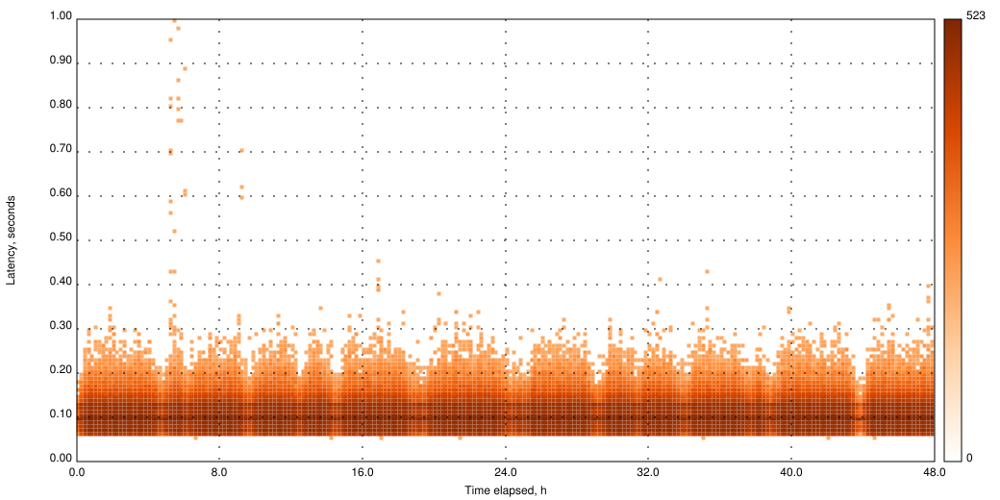

perfdb
==========

  

**perfdb** is a time series database optimized for performance measurements.

Why?
----

Yes, this is [yet](https://github.com/dustin/seriesly) [another](http://influxdb.com/) [time series](https://github.com/prometheus/prometheus) [database](https://github.com/Preetam/catena) written in Go.
There are also many other beautiful non-Go implementations like [cube](https://github.com/square/cube), [KairosDB](https://github.com/kairosdb/kairosdb) or [OpenTSDB](http://opentsdb.net/).
Unfortunately, most of them are designed for continuous monitoring and essentially implement different requirements.
Also many databases are overly complicated or have tons of dependencies.

**perfdb** was created to address daily needs of performance benchmarking.
The storage was implemented so that one can accurately aggregate and visualize millions of samples.

It's not aimed to support flexible queries. But it produces nice SVG graphs and helps to explore data via convenient REST API.

The last but not least, **perfdb** is distributed as a single binary file with literally zero external dependencies.

Storing samples
---------------

Let's say you measure application latency several times per second.
Each sample is a JSON document:

	{
		"read_latency": 12.3
	}

To persist measurements, send the following HTTP request:

	curl -X POST http://localhost:8080/mydatabase -d '{"read_latency":12.3}'

where:

  `mydatabase` is time series database name. It's recommended to create a separate database for each benchmark.

Obviously, you will rather use your favourite programming language to send HTTP requests.

It's absolutely OK to create thousands of databases.

Aggregation and visualization
-----------------------------

This API returns JSON document with aggregated characteristics (mean, percentiles, and etc.):

	$ curl -s http://127.0.0.1:8080/mydatabase/read_latency/summary | python -m json.tool
	{
		"avg": 5.82248,
		"count": 200000,
		"max": 100,
		"min": 0,
		"p50": 3,
		"p80": 9,
		"p90": 14,
		"p95": 21,
		"p99": 40,
		"p99.9": 76
	}

Please note that Python is used for demonstration purpose only.

Finally, it is possible to generate heat map graphs in SVG format (use your browser to view):

	http://127.0.0.1:8080/mydatabase/read_latency/heatmap

Each rectangle is a cluster of values. The darker color corresponds to the denser population. 
The legend on the right side of the graph (the vertical bar) should help to understand the density.

Browsing data
-------------

To list all available database, use the following request:

	$ curl -s http://127.0.0.1:8080/ | python -m json.tool
	[
		"mydatabase"
	]

To list all metrics, use request similar to:

	$ curl -s http://127.0.0.1:8080/mydatabase | python -m json.tool
	[
		"read_latency",
		"write_latency"
	]

Querying samples
----------------

Only bulk queries are supported, but even they are not recommended.

To get the list of samples, use request similar to:

	$ curl -s http://127.0.0.1:8080/mydatabase/read_latency | python -m json.tool

Output is a JSON document with all timestamps and values:

	[
		[
			1437137708114,
			10
		],
		[
			1437137708118,
			15
		],
		[
			1437137708122,
			16
		]
	]

The first value in the nested list is the timestamp (the number of milliseconds elapsed since January 1, 1970 UTC).

The second value is the stored measurement (integer or float).

Getting started
---------------

The latest stable **perfdb** binaries are available on the [Releases](https://github.com/pavel-paulau/perfdb/releases) page.

Just download the file for your platform and run it in terminal: 

	$ ./perfdb 

	:-:-: perfdb :-:-:			serving http://127.0.0.1:8080/

The command above starts HTTP listener on port 8080.
Folder named "data" will be created in the current working directory by default.

It possible to specify custom setting using CLI arguments:

	$ ./perfdb -h
	Usage of ./perfdb:
	  -address="127.0.0.1:8080": serve requests to this host[:port]
	  -fsync=false: Enable fsync calls after every write operation
	  -path="data": PerfDB data directory

There is also sample-docs executable available on the [Releases](https://github.com/pavel-paulau/perfdb/releases) page.

While running perfdb in background, execute this program without any arguments:

	$ ./sample-docs

It will generate 100K random samples. This data set will help to get familiar with the most fundamental API.

Reference
---------

Please read the following articles to understand the complexity of times series databases:

- [Thoughts on Time-series Databases](http://jmoiron.net/blog/thoughts-on-timeseries-databases/) by Jason Moiron

- [Time-Series Database Requirements](http://www.xaprb.com/blog/2014/06/08/time-series-database-requirements/) by Baron Schwartz
